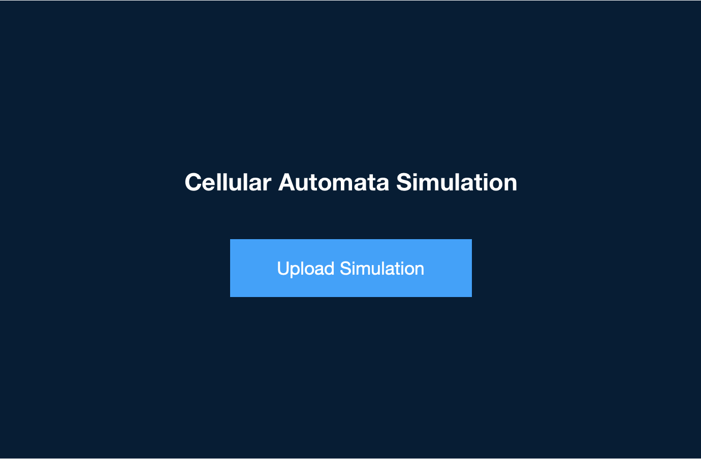
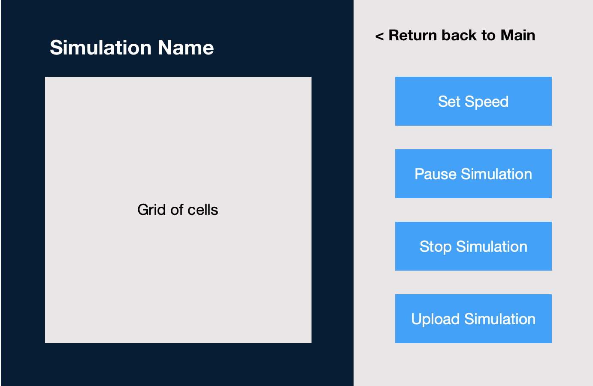

# Simulation Design Plan
### Team Number: 17
### Names
Olga Suchankova

Himanshu Jain

Kyra Chan

## Introduction
The primary goal of this project is to animate any given 2D cellular automata simulation, 
which will be provided as an input XML file. The program should be able to illustrate how
the behavior of each cell in the grid depends on its neighboring grids, so the implementation
of these rules should be flexible within the program. More specifically, the program needs 
to be able to perform the following functions:
* Read an XML formatted file that determines the initial configuration of the simulation
* Implement the grid of cells that will be used to present the simulation
* Create the simulation algorithm that determines how each cell is updated at every time step
* Display the state of the simulation animation until the user stops the simulation or reloads
  a new simulation
* Allow users to control the simulation, for example, pause and resume the animation, slow 
  down or speed up the animation rate, etc.
With regards to this program’s design goals, the code should attempt to keep classes separate,
eliminate all duplicated code, and ensure that the methods are readable.

## Overview
The following is a general overview of our classes and methods, based on the CRC cards that
we made:

1. Main class:
    * Start method - Initializes window with title, creates javafx group, and the animation
     timeline, calls the step method
    * Step method - checks status of simulation, then updates after a certain time step
2. Configuration class:
    * XML file read method - returns rules, initial state of grid, grid size
    * Grid set up method (calculates the size of each cell depending on set width and height 
     of screen) - returns grid layout
    * Initialize grid method (sets up the initial configuration of grid) - returns grid
    * Make graph method - using the rules, for each matrix entry creates a cell object and 
     initializes its neighbors (this is iterating through the grid matrix, checks to make sure
     that based on the rules, there are enough cells in each direction to add all neighbors, 
     if not, make sure to not go out of bounds of the array)
    * Randomization method - making the initial conditions of the grid random - returns cell
     type
    * Loads all of the cells that can be updated into a data structure such as a set
3. Simulation class:
    * Update simulation method - for a single time step, this method goes through all the cells
      that have the potential to be updated and checks to see if the cell type is to change or
      remain the same based on the rules.
    * Check rules for single cell - checks to see if a cell is to be updated or stay the same
    * Adds all cells (new) to group - adds cells to group
    * Remove cells - remove all cells in a set from the group
4. Visualization class: 
    * Pause/resume simulation method (utilizes a boolean to indicate the state of the program,
      whether it is running or not) - either returns the boolean or just converts the boolean’s
      state
    * End/reset simulation method (clears the data structure and resets the simulation to 
     animate a new initial configuration) - returns void
    * takeInput method- It changes the value of the programState on the basis of the input from 
    the user. This is used to check if the simulation has to be run, paused, ended or restarted.  
5. Cell superclass:
    * Parameters: ImageView / color, cell type, cell neighbors, cell id (coordinates in 
     matrix), can cell be updated
    * Change cell method - decide whether or not the cell will change into a different type 
     of cell (either destroy and make new cell, or change cell type)
    * Create image method (for each individual cell) - creates the image/ImageView that is
     used for the cell present in the grid 
6. Cell subclass:
    * Sets the “can cell be updated” parameter to either true or false
    * If destroy and make new cell implementation is taken, then the change cell method is 
     specific to each cell type, also adds the cell that is to be destroyed to a set. This 
     set is removed from the group root in the simulation class
7. Splash class:
    * Build splash scene method
    * Build animation scene method
    * Create button method
    * Creates gui file upload
    * CheckUserInput - checks to see if user input is as requested, updates status

## User Interface
The general user interface mainly comprised of two screens, the main home screen that is 
first displayed when the simulation program is run, and the animation screen that displays 
the grid of cells with the animation running. On the main screen, there is just one primary 
button that allows the user to upload an XML file to initialize the set up of the simulation.
Once the simulation starts running, the screen changes to the animation screen. The 
animation screen displays the grid on the left, with the simulation name above it, and a 
tool bar on the right that allows the user to make adjustments to the simulation. Several
buttons will be created, such as the pause/resume button, the set animation speed rate button, 
the stop button, and the upload-new-file button. The user will also be able to return to the 
main home screen from the animation screen, which will stop the animation and allow the user 
to upload a new XML file.

## Design Details
#### Components
1. Main class:
    * Methods:
        * main() - launch(args):
        * start() - initializes all the pages of the program (splash and visualization), sets 
        up the window parameters and starts the timeline and calls the step() method.
        * step() - based on the status of the simulation, calls the step methods in either 
        splash class or simulation class.
2. Configuration class:
    * Methods:
        * readFile(): It reads the XML file and gets the rules, the size of the grid and 
        the different cell that have to be created. It is used to make the initial state 
        of the grid that is going to run the Simulation. It calls the setUp() method with 
        the parameters to make the grid.     
        * setUp(): returns the grid layout by getting the values from the readFile method. 
        It gets the values from the readFile method and sets the grid on the basis by also 
        considering the width and the height of the screen. 
        * initialiseGrid(): This is called after the setUp() method and is used to make the 
        actual grid. The setUp grid returns the cell height and width and this method 
        creates the grid on the basis of that. 
        * makeGraph(): Since we are using a graph, this method is used to create the graph 
        by adding all the cells to the graph that is made. It also initialises the neighbours 
        by taking into consideration the rules. 
        * random(): It is used to randomly set the initial state of the cell by calling the 
        cell class. This makes sure that whenever the program runs, the configuration of the 
        cells are not the same.
    * Variables:
        * Grid: This is the grid that is made by the initialiseGrid method.
        * Graph: This is the graph that is created by the makeGraph method. 
        * Cell Configurations: The different values of each cell that are set by the random 
        method. This is used to make the graph. 
        * File: This is the file that is read by the method readFile and helps in making the 
        overall grid and the graph. 
3. Simulation class:
    * Methods:
        * simulate(): goes through all the cells one by one and calls the checkUpdate() 
        method to see if the cell has to be updated or not. This method is called multiple 
        times to iterate through the whole grid and check every single cell in the grid. If 
        checkUpdate() returns true, the cell is updated by calling the Update method in the 
        cell class. 
        * checkUpdate(): We check if the rules would apply to the cell or not and the state 
        of the cell updated to Update so that when it is checked in simulate class, the cell 
        returns true and the state of the cell updates. The rules are checked by calling the 
        checkRules() method in the cell class as the rules are contained inside the cell class. 
        * addCells(set) - adds all the cells in a given set to the root group
        * removeCells(set) - removes all cells in a given set from the root group
    * Variables:
        * Update: It is a boolean value that is set to true when the cell has to be updated 
        because of the rules. Initially, it is set to False and is updated if the rules 
        require the cell to be updated.
4. Visualization class:
    * Methods:
        * run(): It is used to check if the program has to be paused or should be played based 
        on the input from the user. It checks the value of the programState and runs or pauses 
        the program	on the basis of that.  
        * rerun(): The method is called when the simulation has to be ended or restarted based 
        on the input from the user. It checks the value of programState and works on the basis 
        of the value of that.
        * setProgState(): It changes the value of the programState on the basis of the input 
        from the user. This is used to check if the simulation has to be run, paused, ended or 
        restarted. 
    * Variables: 
	    * programState: It is an integer value that decides the state of the program. When 
	    it is 1, the run method is called and when it is 2, the simulation is paused. When 
	    the number is set to 3, the simulation is restarted and it is ended on 4.
5. Cell superclass (and subclasses):
    * Methods:
        * String checkChangeCell(): method meant to be overridden by the subclass. To be called 
        by the simulation class to check to see if The cell should be updated. Returns a string 
        that represents the cell type to be updated to
        * replaceCell(String cellType): destroys cell and creates a new instance of a different 
        cell Type based on input.
        * createImageView(int x, int y, String color): returns an image view of the cell, which 
        can be added by the simulation class to the root group.
6. Splash class:
    * Methods:
        * loadObjects()- loads all objects into the splash screen
        * listenforUserInput - listens and executes the input of the user to upload a file and 
        start the simulation. Updates the status of the program

## Design Considerations
Algorithm which updates all cells for a time step is to be determined. The first 
implementation that our team will go with is going to be a brute force algorithm, checking 
nearly all of the cells for each time step. However, more efficient algorithms such as DFS 
and BFS exist and will be explored after all of the required components are implemented.

#### Use Cases
* Apply the rules to a middle cell: The simulate() method will loop through all possible 
cells that can be updated, and for each cell, which has an associated Set parameter of 
neighboring cells, the method will check for possible updates.
* Apply the rules to an edge cell: The process is similar to a middle cell, except the 
associated Set parameter of neighboring cells will simply be a smaller Set. By using this 
graph method, our program will not have to hard-code specific edge cases.
* Move to the next generation: The step() method in the Main class will keep track of the 
animation updates for each state in the simulation. This method will call methods from the 
Simulation class to check for cells that can be updated, then update those cells according 
to the configuration rules.
* Set a simulation parameter: If a simulation contains a simulation parameter, this should 
be put in the XML file and will be read in the Configuration class. When each cell class is 
created, the cell would have an attribute that will determine the next state of the cell 
according to the cell type, which would be based on the rules and simulation parameters.
* Switch simulations: A gui file upload screen will pop up for the user to input an XML 
file. This file will be passed on to the Configuration class which will read the file, and 
create Cell subclasses that will update according to the rules and simulation parameters 
based on the cell type. The Visualization class will also be called to stop the simulation 
before the Configuration class initializes the grid set up method and restarts the animation.

## Team Responsibilities

 * Team Member #1: Kyra Chan
    * Visualization class
    * Splash class
 * Team Member #2: Olga Suchankova
    * Simulation class
    * Cell classes
 * Team Member #3: Himanshu Jain
    * Configuration class
